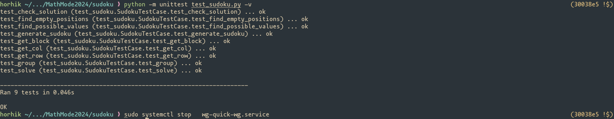
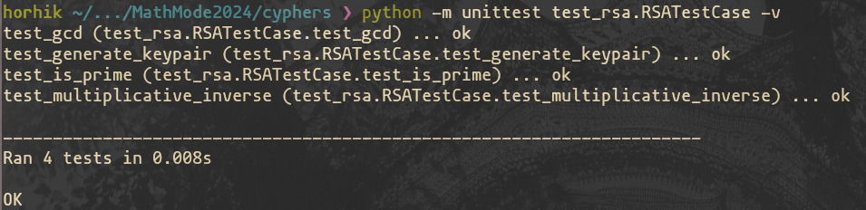
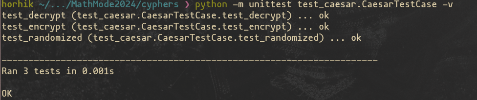
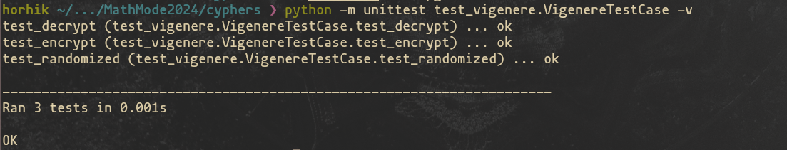

# MathMode2024

## Task 1: [Sudoku](https://github.com/Horhik/MathMode2024/blob/main/homework-01/sudoku.py)

🥳 *All test are passed* 🎉

## Task 2: [Cyphers](https://github.com/Horhik/MathMode2024/blob/main/homework-02)

*RSA:*

*Caesar:*

*Vigenere:*

